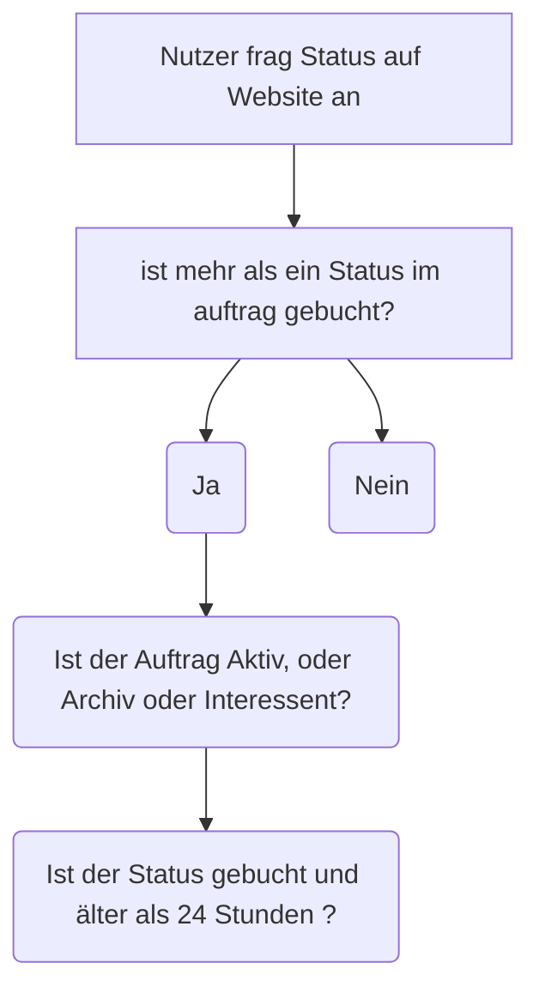

!!! note "FakeTime Ablauf"
    Hier wird der Ablauf im Sinne von Pseudocode wiedergespiegelt.

```mermaid
graph TD
A[Nutzer frag Status auf Website an] -->B[ist mehr als ein Status im auftrag gebucht?]
B --> C(Ja)
B --> D(Nein)

C --> F(Ist der Auftrag Aktiv, oder Archiv oder Interessent?)
F --> G(Ist der Status gebucht und älter als 24 Stunden ?)

```